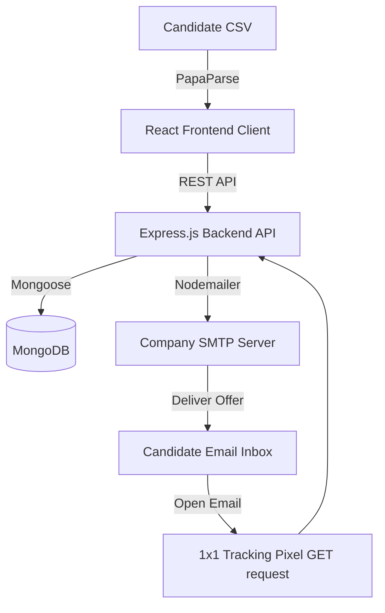

# OfferFlow HR — Comprehensive Interview & Project Prep Guide

This guide is designed to help you explain, navigate, and walkthrough the **OfferFlow HR** codebase during technical interviews. It contains direct instructions on how to explain the project architecture, directory breakdown, key features, and script-like answers for "open the code for X" scenarios.

---

## 🚀 Part 1: Project Overview & Architecture

### What is OfferFlow HR?
**OfferFlow HR** is a premium, enterprise-grade MERN-stack bulk offer letter generator dashboard. It automates the HR onboarding workflow by allowing users to upload candidate spreadsheets, clean and review data in an interactive grid, customize letter templates (Modern, Classic, Minimal) using a custom WYSIWYG editor with dynamic variables, send personalized emails via SMTP (Nodemailer), and track delivery statistics (Sent, Failed, Opened) in real-time.

### System Architecture
The application follows a decoupled client-server architecture:
1. **Frontend (React / Vite)**: Single Page Application (SPA) utilizing CSS custom properties for theme styling (Light & Dark modes), global state management via React Context (`AppContext.jsx`), and PapaParse for high-performance client-side CSV processing.
2. **Backend (Node.js / Express)**: RESTful API server connected to MongoDB via Mongoose. It handles template CRUD, campaign organization, candidate status management, email scheduling, and email open tracking.
3. **Database (MongoDB)**: Stores company profiles, custom templates, candidate records, campaigns, and delivery audit logs.



---

## 📂 Part 2: Folder & File Breakdown

Here is a map of the codebase. Memorize these directories so you can jump to them instantly if asked to "open the folder."

### 📁 `/backend` (API Server)
- **[server.js](file:///c:/Users/Shreyam/OneDrive/Desktop/OfferLetter%20Generator/backend/server.js)**: API entry point. Initializes Express middleware (JSON parser, CORS), establishes MongoDB connection, and binds all route endpoints (`/api/companies`, `/api/templates`, etc.).
- **`/backend/config`**:
  - **[db.js](file:///c:/Users/Shreyam/OneDrive/Desktop/OfferLetter%20Generator/backend/config/db.js)**: Mongoose database connection initialization.
  - **[seed.js](file:///c:/Users/Shreyam/OneDrive/Desktop/OfferLetter%20Generator/backend/config/seed.js)**: Seeds initial demo companies and templates (Modern/Classic) if the database is empty on launch.
- **`/backend/models`** (Database Schemas):
  - **[Company.js](file:///c:/Users/Shreyam/OneDrive/Desktop/OfferLetter%20Generator/backend/models/Company.js)**: Sender details, website, custom SVG/base64 logo, and encrypted SMTP configuration.
  - **[Template.js](file:///c:/Users/Shreyam/OneDrive/Desktop/OfferLetter%20Generator/backend/models/Template.js)**: Custom letter layouts (subject, body template with variables, styling choice).
  - **[Campaign.js](file:///c:/Users/Shreyam/OneDrive/Desktop/OfferLetter%20Generator/backend/models/Campaign.js)**: Tracks batch statistics (total sent, failed, pending).
  - **[Candidate.js](file:///c:/Users/Shreyam/OneDrive/Desktop/OfferLetter%20Generator/backend/models/Candidate.js)**: Candidate records, dispatch status, custom CSV fields, and tracking info.
- **`/backend/routes`** (REST Endpoints & Controllers):
  - **[campaigns.js](file:///c:/Users/Shreyam/OneDrive/Desktop/OfferLetter%20Generator/backend/routes/campaigns.js)**: Handles campaign initiation, candidate bulk-upserts, and inline row-editing.
  - **[email.js](file:///c:/Users/Shreyam/OneDrive/Desktop/OfferLetter%20Generator/backend/routes/email.js)**: SMTP verification and the asynchronous mail merge sending loop. Also hosts the email open tracking pixel router.

### 📁 `/frontend` (React SPA Client)
- **[App.jsx](file:///c:/Users/Shreyam/OneDrive/Desktop/OfferLetter%20Generator/frontend/src/App.jsx)**: Main navigator. Switches views based on active state (Workflow wizard vs Archive history vs Settings).
- **[index.css](file:///c:/Users/Shreyam/OneDrive/Desktop/OfferLetter%20Generator/frontend/src/index.css)**: Global stylesheet. Handles variable tokens for Light/Dark mode, layouts, scrollbars, and print layout overrides.
- **`/frontend/src/context`**:
  - **[AppContext.jsx](file:///c:/Users/Shreyam/OneDrive/Desktop/OfferLetter%20Generator/frontend/src/context/AppContext.jsx)**: Global React state. Controls theme state, active wizard steps, loaded templates, and API fetch abstractions.
- **`/frontend/src/components`**:
  - **[CsvUpload.jsx](file:///c:/Users/Shreyam/OneDrive/Desktop/OfferLetter%20Generator/frontend/src/components/CsvUpload.jsx)**: Step 1. PapaParse processes CSV files on the client and uploads rows to initialize a campaign.
  - **[DataReview.jsx](file:///c:/Users/Shreyam/OneDrive/Desktop/OfferLetter%20Generator/frontend/src/components/DataReview.jsx)**: Step 2. Spreadsheet-style editor enabling candidates list search, validation, edits, and deletions.
  - **[TemplateEditor.jsx](file:///c:/Users/Shreyam/OneDrive/Desktop/OfferLetter%20Generator/frontend/src/components/TemplateEditor.jsx)**: Step 3. Layout customizer with drag-and-drop variables, HTML mode toggles, and scaled template style selectors (Modern, Classic, Minimal).
  - **[PreviewSend.jsx](file:///c:/Users/Shreyam/OneDrive/Desktop/OfferLetter%20Generator/frontend/src/components/PreviewSend.jsx)**: Step 4. Controls dispatch delays, triggers campaigns, displays sending progress bar in real-time, and exports A4 PDFs on the client side.
  - **[HistoryTab.jsx](file:///c:/Users/Shreyam/OneDrive/Desktop/OfferLetter%20Generator/frontend/src/components/HistoryTab.jsx)**: Analytics logs tab showing campaigns dispatched, delivery rates, open rates, and search logs.
  - **[SettingsTab.jsx](file:///c:/Users/Shreyam/OneDrive/Desktop/OfferLetter%20Generator/frontend/src/components/SettingsTab.jsx)**: Handles SMTP verification parameters and company branding config.

---

## 🎯 Part 3: Interview Walkthrough Scenarios & Code References

Use these scripts and code references when the interviewer asks you to walk through a specific codebase feature.

### Scenario 1: "Show me how the CSV data ingestion works."
- **Where to navigate:** Open [CsvUpload.jsx](file:///c:/Users/Shreyam/OneDrive/Desktop/OfferLetter%20Generator/frontend/src/components/CsvUpload.jsx#L34-L78).
- **How to explain:**
  > *"When a user drops a candidate spreadsheet, we parse it directly on the client side using PapaParse inside `CsvUpload.jsx`. We validate that essential columns (Name, Email, Role, Salary, JoiningDate) exist. If they do, we send a POST request to `/api/campaigns` which instantiates the campaign and performs a bulk upsert of candidate models inside the backend campaigns router."*
- **Code Highlights:**
  - Client side: `Papa.parse(file, { header: true, skipEmptyLines: true, ... })`
  - Server side: `Candidate.insertMany(...)` or `bulkWrite(...)` inside `backend/routes/campaigns.js`.

### Scenario 2: "Show me the email sending engine & async mail-merge loops."
- **Where to navigate:** Open [email.js](file:///c:/Users/Shreyam/OneDrive/Desktop/OfferLetter%20Generator/backend/routes/email.js#L110-L195).
- **How to explain:**
  > *"The email sending loop executes asynchronously on the server inside `/routes/email.js`. It fetches active candidate documents, extracts the template, and performs a mail-merge operation by replacing double-curly brace variables (e.g. `{{Name}}`) with candidate values. It sets up a Nodemailer transporter using the company's verified SMTP configurations, loops through the candidates, sends the emails, and updates their status in the database step-by-step so the frontend can display real-time progress."*
- **Code Highlights:**
  - Dynamic mail merge:
    ```javascript
    const compileTemplate = (html, candidate) => {
      let result = html;
      result = result.replace(/\{\{Name\}\}/g, candidate.name);
      result = result.replace(/\{\{Role\}\}/g, candidate.role);
      // ... replacements
      return result;
    };
    ```
  - Asynchronous batching logic with configurable delay intervals using `setTimeout` wrapped in a Promise.

### Scenario 3: "Explain how you implemented real-time Email Open Tracking."
- **Where to navigate:** Open [email.js](file:///c:/Users/Shreyam/OneDrive/Desktop/OfferLetter%20Generator/backend/routes/email.js#L20-L50) (Tracking endpoint & Pixel injection).
- **How to explain:**
  > *"To track email opens, we use a 1x1 transparent tracking pixel. When Nodemailer constructs the email HTML body, we inject a tracking `` tag at the bottom (e.g., ``). When the candidate opens the email, their mail client requests this image. Our backend routes this request to a tracking endpoint that updates the candidate's status to 'Opened' and records the timestamp, then serves a raw transparent GIF buffer with caching disabled."*
- **Code Highlights:**
  - Transparent GIF serving:
    ```javascript
    const trackingPixel = Buffer.from(
      "R0lGODlhAQABAIAAAAAAAP///yH5BAEAAAAALAAAAAABAAEAAAIBRAA7",
      "base64"
    );
    res.writeHead(200, {
      "Content-Type": "image/gif",
      "Content-Length": trackingPixel.length,
      "Cache-Control": "no-store, no-cache, must-revalidate, private"
    });
    res.end(trackingPixel);
    ```

### Scenario 4: "Show me the Template Editor, dynamic scaling, and template styles."
- **Where to navigate:** Open [TemplateEditor.jsx](file:///c:/Users/Shreyam/OneDrive/Desktop/OfferLetter%20Generator/frontend/src/components/TemplateEditor.jsx#L85-L105) and [index.css](file:///c:/Users/Shreyam/OneDrive/Desktop/OfferLetter%20Generator/frontend/src/index.css#L1164-L1190).
- **How to explain:**
  > *"The editor allows customizing Modern, Classic, or Minimal layouts. To provide a pixel-perfect print layout beside the editor canvas, we render an A4-proportioned paper preview box. We use a ResizeObserver to dynamically calculate the width and height of the preview viewport, and apply a CSS scale transform (e.g., `transform: scale(0.6)`) to match the container space perfectly without causing layout breaking or clipping."*
- **Code Highlights:**
  - Scaling logic in `TemplateEditor.jsx`:
    ```javascript
    const scale = Math.min(containerWidth / sheetWidth, containerHeight / sheetHeight);
    setScale(scale);
    ```

### Scenario 5: "How did you implement Light/Dark Mode theme switching?"
- **Where to navigate:** Open [AppContext.jsx](file:///c:/Users/Shreyam/OneDrive/Desktop/OfferLetter%20Generator/frontend/src/context/AppContext.jsx#L50-L75) and [index.css](file:///c:/Users/Shreyam/OneDrive/Desktop/OfferLetter%20Generator/frontend/src/index.css#L150-L240).
- **How to explain:**
  > *"We manage the theme state at the root level using React Context in `AppContext.jsx`. When the user toggles the theme, it modifies a class name (`dark-mode`) on the document `<body>` tag and caches their preference in `localStorage`. In CSS, we define color tokens (background-colors, borders, shadows, text styles) using CSS custom properties (`--bg-app`, `--bg-card`, etc.) under the body and `body.dark-mode` selectors. This provides instantaneous, high-performance transitions without re-rendering components."*

---

## 🛠️ Part 4: Critical Troubleshooting & Problem Solving Scenarios

These are actual layout and system bugs that we resolved, and explaining how you solved them shows your senior full-stack capability!

### 1. "The page was cut-off and non-scrollable. How did you resolve it?"
- **The Problem:** A fixed viewport height restriction (`calc(100vh - 118px)`) and `overflow: hidden` was set on the editor shell, causing the editor textarea and save buttons to be completely clipped and inaccessible on smaller screens.
- **The Solution:**
  1. We replaced the hard height and overflow rules on the outer shell container so that the page can scroll naturally.
  2. We set a minimum height constraint (`min-height: 650px`) and dynamic height (`height: calc(100vh - 280px)`) on the `.template-grid` element. This guarantees that the editing area is always spacious (leaving enough room for the textarea) and that the page scrolls dynamically on shorter viewports.

### 2. "The branding logo expanded out of bounds and broke the layout. How did you fix it?"
- **The Problem:** SVGs injected via base64 or raw code did not have explicit width/height boundaries inside the branding preview element. As a result, the browser rendered the SVG at its full default resolution, expanding the configuration bar card to be huge and pushing the rest of the editor off-screen.
- **The Solution:** We introduced custom CSS class wrappers (`.logo-svg-wrapper` and `.logo-img-wrapper`) that encapsulate the logo element and override any internal SVG attributes with maximum bounds (`width: 32px; height: 32px; flex-shrink: 0;`), stabilizing the top layout bar.

---

## 🎓 Part 5: Senior Architectural FAQs

**Q: Why use a 1x1 base64 GIF instead of a PNG or JSON request for tracking?**
- *Answer*: GIFs are the lightest possible graphic format. The base64 string `R0lGODlhAQABAIAAAAAAAP///yH5BAEAAAAALAAAAAABAAEAAAIBRAA7` is only 43 bytes. Furthermore, transparent GIFs are supported by 100% of email clients and do not trigger layout shifts or visual discrepancies inside candidate email lists.

**Q: How do you handle SMTP password security?**
- *Answer*: In a production setup, we encrypt the SMTP configuration in the Database before storing it, and decrypt it in-memory inside the email route during Nodemailer transport initialization. This prevents plaintext passwords from leaking in database backups.

**Q: Why did you parse CSV on the Client-side rather than the Server-side?**
- *Answer*: Performing CSV parsing on the client using PapaParse offloads computing cycles from our API server. It also allows us to run instant schema verification and let the user inspect the candidates list grid (Step 2) before initiating database resources or uploading large payloads.
